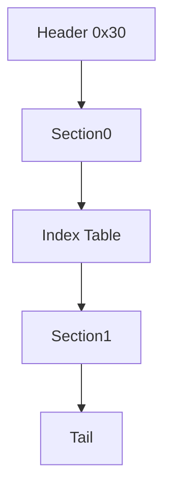

# ADB 脚本格式（NBDA）

## 文件布局

- 头部固定 `0x30` 字节（12 个 `u32`，小端）
- `header[0] = 0x4144424E`（ASCII: `NBDA`）
- `header[1] = 0x00010000`
- `header[4] = section0_size`
- `header[5] = index_count`
- `header[6] = section1_size`

总长度校验：

`0x30 + section0_size + index_count*4 + section1_size + tail_size`

## 头字段

| 偏移 | 类型 | 名称 | 说明 |
|---|---|---|---|
| `0x00` | `u32` | `magic` | 固定 `NBDA` |
| `0x04` | `u32` | `version` | 固定 `0x00010000` |
| `0x08` | `u32` | `unk_08` | 未确认 |
| `0x0C` | `u32` | `unk_0C` | 未确认 |
| `0x10` | `u32` | `section0_size` | section0 字节数 |
| `0x14` | `u32` | `index_count` | 索引数量 |
| `0x18` | `u32` | `section1_size` | section1 字节数 |
| `0x1C` | `u32` | `unk_1C` | 未确认 |
| `0x20` | `u32` | `unk_20` | 未确认 |
| `0x24` | `u32` | `unk_24` | 未确认 |
| `0x28` | `u32` | `unk_28` | 未确认 |
| `0x2C` | `u32` | `unk_2C` | 未确认 |

## 数据区

1. `section0`（长度 `section0_size`）
2. `index_u32[]`（长度 `index_count`）
3. `section1`（长度 `section1_size`）
4. `tail`（文件剩余字节）

## 指令模型

- `index_u32[i]` 指向 `section1` 内槽位偏移。
- 多个索引可以指向同一偏移（共享槽位）。
- 槽位按 `u16 opcode` 开头；非文本槽位按 `words` 或 `bytes` 保留。
- `entries[]` 保存执行序列，`slots[]` 保存去重后的槽位数据。

## OP 列表

| Opcode | Mnemonic |
|---|---|
| `0x0001` | `JUMP_RESUME` |
| `0x0002` | `SCENE_LOAD_OR_REUSE` |
| `0x0003` | `SCENE_NEXT` |
| `0x0005` | `SCENE_CALL` |
| `0x0006` | `SCENE_RETURN` |
| `0x0007` | `JUMP_ABS` |
| `0x0008` | `EVAL_EXPR` |
| `0x0009` | `JUMP_IF` |
| `0x0010` | `CMD_0010` |
| `0x0011` | `CMD_0011` |
| `0x0012` | `WAIT_EVENT` |
| `0x0013` | `SET_FLAG_0013` |
| `0x0100` | `MESSAGE_BOX` |
| `0x0200` | `DIALOGUE_LINE` |
| `0x0300` | `CMD_0300` |
| `0x0301` | `CMD_0301` |
| `0x0303` | `CMD_0303` |
| `0x0305` | `CMD_0305` |
| `0x0400` | `CMD_0400` |
| `0x0402` | `CMD_0402` |
| `0x0404` | `CMD_0404` |
| `0x0410` | `CMD_0410` |
| `0x0412` | `CMD_0412` |
| `0x0420` | `CMD_0420` |
| `0x0422` | `CMD_0422` |
| `0x0500` | `CMD_0500` |
| `0x0600` | `TEXT_META` |
| `0x0601` | `TEXT_DIALOGUE` |
| `0x0602` | `TEXT_BEGIN` |
| `0x0603` | `TEXT_END` |
| `0xFFFF` | `END` |

## `0x0601` 文本槽位结构

| 顺序 | 类型 | 字段 | 说明 |
|---|---|---|---|
| 1 | `u16` | `opcode` | 固定 `0x0601` |
| 2 | `u16` | `speaker_u16` | 说话人编号 |
| 3 | `u16` | `text_len_u16` | UTF-16 code unit 数 |
| 4 | `u16[text_len]` | `text` | 文本内容 |
| 5 | `u16` | `terminator` | 固定 `0x0000` |
| 6 | `u16[]` | `suffix_words` | 后缀参数 |

## ADBSRC 文本格式

ADBSRC 是 IR 的可逆文本表示，扩展名固定 `.adbsrc`。

头部示例：

```text
version 1
format NBDA
mode ir
magic_u32 0x4144424E
version_u32 0x00010000
header_u32 0x4144424E 0x00010000 0x00000000 0x00000000 0x00000000 0x00000000 0x00000000 0x00000000 0x00000000 0x00000000 0x00000000 0x00000000
section0_hex ...
tail_hex ...
[slots]
...
[entries]
...
```

槽位行：

```text
slot 00010 off=0x000000E4 op=0x0300 mnemonic=CMD_0300 words=[0x0300, 0x0008, 0x0000]
slot 00022 off=0x000001CA op=0x0601 mnemonic=TEXT_DIALOGUE speaker=0x0001 text="..." suffix=[]
slot 00100 off=0x00001000 bytes=[0xFF, 0x00, 0x7A]
```

执行序列行：

```text
entry 00022 off=0x000001CA slot=00022 op=0x0601 mnemonic=TEXT_DIALOGUE editable=1
```

说明：

- `text` 必须是 JSON 字符串字面量。
- 只改 `text` 即可做文本汉化；编译器会自动重算 `text_len_u16` 与偏移。

## 工具对应

- `adb_decompile.py`：ADB -> JSON/ADBSRC（默认 JSON）
- `adb_compile.py`：JSON/ADBSRC -> ADB（默认 JSON）
- `adb_to_adbsrc.py`：ADB -> ADBSRC 快捷入口

## Mermaid


