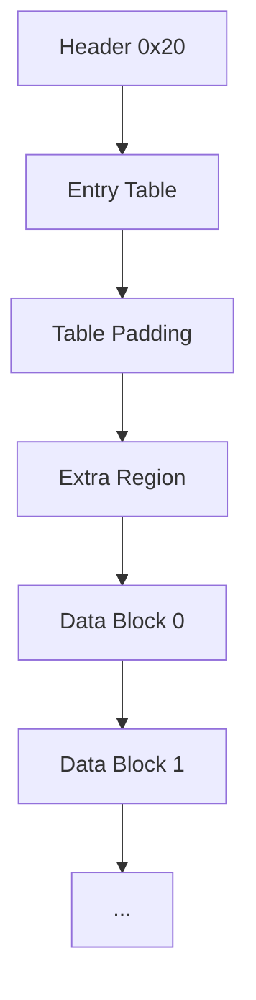

# CSAF 资源包格式

## 头部

| 偏移 | 类型 | 名称 | 说明 |
|---|---|---|---|
| `0x00` | `char[4]` | `magic` | 固定 `CSAF` |
| `0x04` | `u32` | `version_flags` | 低 31 位版本（`0x00010000`），最高位为加密标志 |
| `0x08` | `u32` | `file_count` | 文件数量 |
| `0x0C` | `u32` | `extra_size` | 扩展区长度（字节） |
| `0x10` | `byte[16]` | `md5` | 对“目录区 + 扩展区”的校验 |

## 目录区

- 单条目录项长度 `24` 字节：
  - `hash[16]`：文件名哈希（MD5）
  - `start_block`：文件起始块（4KB 为 1 块）
  - `size`：文件实际字节数
- 目录区总长度：
  `table_size = ((24 * file_count + 31) & 0xFFFFF000) + 4064`

## 总体布局

1. Header（32 字节）
2. Entry Table（`file_count * 24`）
3. Table Padding（补齐到 `table_size`）
4. Extra Region（`extra_size`）
5. File Data Blocks（每块 4096 字节）

## Mermaid

## 解包/封包实现策略

- `csaf_unpack.py`
  - 解析头和目录项
  - 导出文件内容
  - 导出 `manifest.json`（包含 padding 与扩展区）
- `csaf_pack.py`
  - 读取 `manifest.json`
  - 按 `start_block` 与 padding 重建包体
  - 默认保留原 `md5`，可选 `--update-checksum` 重算
