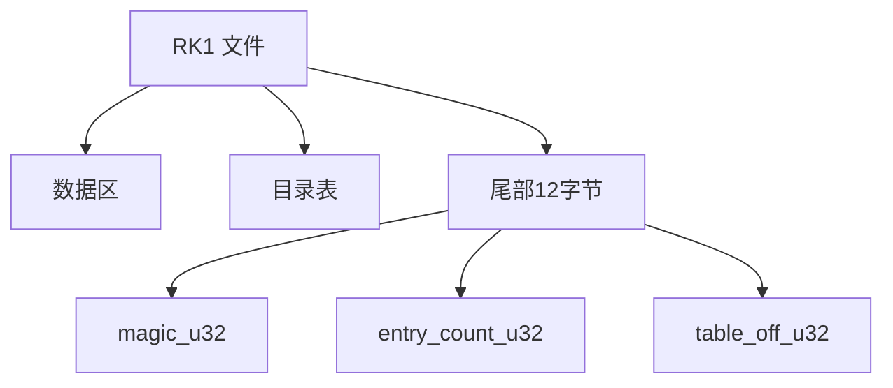

## RK1 资源包结构

### 文件布局

RK1 包由三段组成：

1. 数据区（各 entry 的 packed blob 按顺序拼接）
2. 目录表（`entry_count * 32`）
3. 文件尾（12 字节）



### 尾部结构（12 字节）

| 偏移（相对文件末尾） | 类型 | 字段 | 说明 |
|---|---|---|---|
| `-12` | `u32` | `magic_u32` | 固定 `0x00314B52`（`RK1\0`） |
| `-8` | `u32` | `entry_count_u32` | 目录项数量 |
| `-4` | `u32` | `table_off_u32` | 目录表起始偏移 |

校验关系：

- `table_off_u32 + entry_count_u32 * 32 + 12 == file_size`

### 目录项结构（每项 32 字节）

`struct <16s4I>`

| 偏移（相对目录项） | 类型 | 字段 | 说明 |
|---|---|---|---|
| `+0x00` | `char[16]` | `name` | ASCII 文件名，0 结尾或填零 |
| `+0x10` | `u32` | `packed_size_u32` | 压缩后大小 |
| `+0x14` | `u32` | `unpacked_size_u32` | 解压后大小 |
| `+0x18` | `u32` | `flag_u32` | `0`=不压缩，`1`=LZSS 变体 |
| `+0x1C` | `u32` | `data_off_u32` | packed 数据在文件内偏移 |

### 压缩算法（`flag_u32 == 1`）

LZSS 参数（与当前实现一致）：

- 环形缓冲区大小：`0x1000`
- 初始写指针：`4078`
- flag 逻辑：按 bit 决定 literal/backref
- backref 长度：`(high & 0x0F) + 3`
- backref 起点：`low | ((high & 0xF0) << 4)`

### 解包输出

`nejii_unpack.py` 输出目录结构：

- `files/`：解压后文件
- `packed/`：原始 packed blob（按 entry index 命名）
- `manifest.json`：回封清单（含 sha1）

### 回封策略

`nejii_pack.py` 按 `manifest.json` 回封：

1. 若 `files/<name>` 的 `sha1` 与 `manifest` 中 `unpacked_sha1` 一致：
   - 复用 `packed/<index>.bin`
   - 保持原 `flag_u32/packed_size_u32`，可做到字节级回环
2. 若内容被修改：
   - 当前实现写成不压缩项（`flag_u32 = 0`）
   - `packed_blob = unpacked_blob`
   - `packed_size_u32 = unpacked_size_u32 = len(unpacked_blob)`

### 命令

```powershell
python .\nejii_unpack.py .\game\script.dat .\out\script_unpack
python .\nejii_pack.py .\out\script_unpack\manifest.json .\out\script.repack.dat
```

目录递归：

```powershell
python .\nejii_unpack.py .\game .\out\archives_unpack
python .\nejii_pack.py .\out\archives_unpack .\out\archives_repack
```
