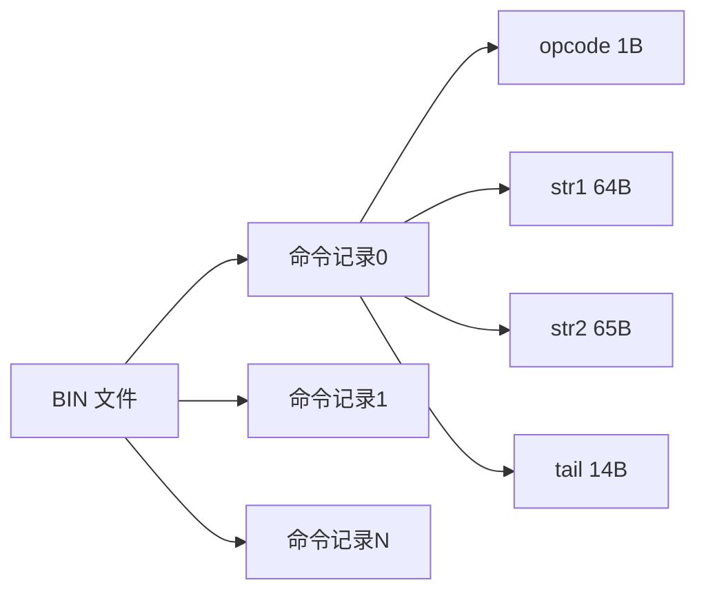

## NEJII 脚本 BIN 结构

### 记录布局

脚本文件由固定长度记录组成：

- `record_size = 144`
- `file_size % 144 == 0`



### 单条记录字段

| 偏移 | 长度 | 类型 | 字段 | 说明 |
|---|---|---|---|---|
| `0` | `1` | `s8` | `opcode_s8` | 操作码 |
| `1` | `64` | `bytes` | `str1_raw` | 文本区1（0 结尾字节串） |
| `65` | `65` | `bytes` | `str2_raw` | 文本区2（0 结尾字节串） |
| `130` | `14` | `bytes` | `tail_raw` | 参数区 |
| `130` | `2` | `u16` | `arg0_u16` | 参数0（覆盖 `tail_raw[0:2]`） |
| `132` | `2` | `u16` | `arg1_u16` | 参数1（覆盖 `tail_raw[2:4]`） |
| `134` | `2` | `u16` | `arg2_u16` | 参数2（覆盖 `tail_raw[4:6]`） |

### 文本编码

- 默认文本编码：`cp932`
- 支持别名：`win-31j` / `sjis` / `shift-jis` / `ms932`
- 可在编译时指定目标编码：`--text-encoding gbk`

### JSON 反编译模型

每条命令包含：

- `index`
- `opcode_s8`
- `mnemonic`
- `arg0_u16/arg1_u16/arg2_u16`
- `str1_raw_hex/str2_raw_hex`
- `str1_decoded/str2_decoded`
- `str1_text/str2_text`
- `str1_original_text/str2_original_text`
- `str1_editable/str2_editable`
- `tail_hex`

编译规则：

1. 未修改文本且可解码时，优先复用 `*_raw_hex`。
2. 文本被修改时，按目标编码写入 `str1/str2` 固定字段。
3. 文本编码后必须满足 `len(payload) + 1 <= field_size`，超长直接报错。
4. `arg0/1/2` 会回写覆盖 `tail` 前 6 字节，其余 tail 保持 `tail_hex`。

### 控制符过滤回写（filter_text）

编译器会读取“输入文件同级目录”的 `filter_text.txt`（UTF-8，逐行）：

- 若 `str1_text` 或 `str2_text` 命中过滤词
- 则该字段强制按“源编码”回写（`source_text_encoding`）
- 不使用目标编码（`text_encoding`）

用途：文本中包含控制符或指令片段时，避免被目标编码改写。

### 指令源码格式（NEJSRC）

`nejsrc` 是行式文本格式：

- 头部：`@meta <json>`
- 指令：`@cmd <json>`

示例：

```text
; NEJSRC v1
@meta {"format":"NEJII_SCRIPT_BIN","record_size_u32":144,"record_count_u32":2,"text_encoding":"cp932"}
@cmd {"index":0,"opcode_s8":100,"mnemonic":"TEXT_LINE","str1_text":"...","str1_decoded":true,...}
@cmd {"index":1,"opcode_s8":110,"mnemonic":"WAIT_INPUT","str1_decoded":false,...}
```

### 常见 opcode 命名

| `opcode_s8` | `mnemonic` |
|---|---|
| `100` | `TEXT_LINE` |
| `105` | `LOG_PUSH` |
| `110` | `WAIT_INPUT` |
| `116` | `WAIT_TIMER` |
| `119` | `SCENE_END` |
| `120` | `BG_LOAD` |
| `122` | `CHAR_LOAD` |
| `124` | `CHAR_CLEAR` |
| `126` | `EVENT_LOAD` |
| `-56` | `END` |
| `-96` | `JUMP_LABEL` |
| `-91` | `IF_GOTO` |
| `-51` | `CHOICE_DEF` |
| `-50` | `CHOICE_MENU` |
| `-4` | `RETURN` |

### 命令

```powershell
python .\nejii_decompile.py .\out\script_unpack\files .\out\bin_json --output-format json --text-encoding cp932
python .\nejii_decompile.py .\out\script_unpack\files .\out\bin_src --output-format nejsrc --text-encoding cp932
python .\nejii_compile.py .\out\bin_json .\out\bin_from_json --input-format json --text-encoding cp932
python .\nejii_compile.py .\out\bin_src .\out\bin_from_src --input-format nejsrc --text-encoding cp932
python .\nejii_compile.py .\out\bin_json .\out\bin_from_json_gbk --input-format json --text-encoding gbk
```
