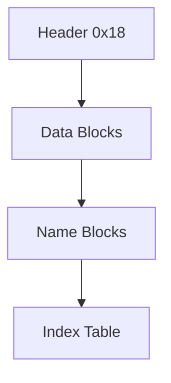

# YKC 资源包结构

## 结论

- 资源包头标识：`YKC001\0\0`
- 固定头部大小：`0x18` 字节
- 索引项大小：`0x14` 字节（5 个 `u32`）
- 文件名使用 `cp932`，并带 `\0` 结尾

## 头部字段

| 偏移 | 类型 | 字段 | 说明 |
|---|---|---|---|
| `0x00` | `char[8]` | `magic8` | `YKC001\0\0` |
| `0x08` | `u32` | `header_size_u32` | 头部大小，样本为 `0x18` |
| `0x0C` | `u32` | `reserved_u32` | 保留字段 |
| `0x10` | `u32` | `table_off_u32` | 索引表偏移 |
| `0x14` | `u32` | `table_size_u32` | 索引表字节数 |

## 索引项字段（每项 0x14 字节）

| 顺序 | 类型 | 字段 | 说明 |
|---|---|---|---|
| 1 | `u32` | `name_off_u32` | 文件名偏移 |
| 2 | `u32` | `name_len_u32` | 文件名字节长度（含 `\0`） |
| 3 | `u32` | `data_off_u32` | 文件数据偏移 |
| 4 | `u32` | `data_len_u32` | 文件数据长度 |
| 5 | `u32` | `unk_u32` | 未确认字段（样本多为 0） |

## 数据布局

1. 头部 `0x18`
2. 文件数据区（按索引引用）
3. 文件名区（按索引引用）
4. 索引表（`entry_count * 0x14`）

## Mermaid

## 工具对应

- `ykdat_unpack.py`：`YKC -> manifest.json + files/`
- `ykdat_pack.py`：`manifest.json + files/ -> YKC`
