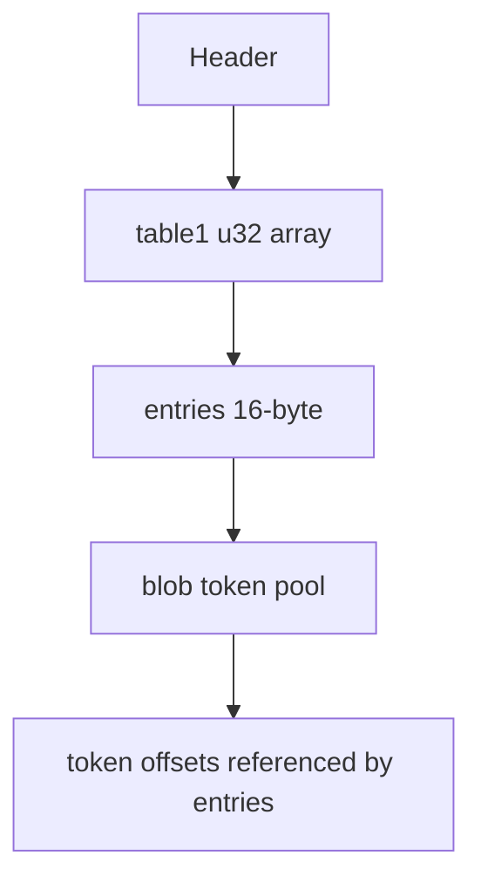

# YKS 脚本结构

## 结论

- 文件头标识：`YKS001\x01\x00`（样本）
- 头部总字段：`8-byte magic + 8*u32`
- 关键区段：
  - `table1`：执行流索引（`u32[]`，值为 `entry_id`）
  - `entries`：指令槽表（每项 `4*u32`）
  - `blob`：字符串/字节池（可选 `xor 0xAA`）

## 头部字段

| 偏移 | 类型 | 字段 | 说明 |
|---|---|---|---|
| `0x00` | `char[8]` | `magic8` | 包含版本与标记位 |
| `0x08` | `u32` | `header_size_u32` | 头部大小，样本为 `0x28` |
| `0x0C` | `u32` | `reserved_u32` | 保留字段 |
| `0x10` | `u32` | `table1_off_u32` | `table1` 偏移 |
| `0x14` | `u32` | `table1_count_u32` | `table1` 项数 |
| `0x18` | `u32` | `entry_off_u32` | `entries` 偏移 |
| `0x1C` | `u32` | `entry_count_u32` | `entries` 项数 |
| `0x20` | `u32` | `blob_off_u32` | `blob` 偏移 |
| `0x24` | `u32` | `blob_size_u32` | `blob` 字节数 |

## 数据区

### table1

- 类型：`u32[]`
- 语义：执行流，元素值为 `entry_id`

### entries

- 类型：每项 `16` 字节（`type_u32, a_u32, b_u32, c_u32`）
- `a_u32/b_u32` 在大量场景下引用 `blob` 内 token 偏移
- `c_u32` 可能为跳转/哨兵值（常见 `0xCDCDCDCD`、`0xFFFFFFFF`）

### blob

- 原始字节池，按 `\0` 切分成 token
- 当 `magic` 中标记位为 `1` 时，`blob` 需按字节 `xor 0xAA`
- 可编辑文本与命令参数都位于该池中

## JSON 与 YKSRC 模型

反编译输出两种等价中间表示：

- `json`：结构化对象，适合程序化处理
- `ykssrc`：逐行可读指令源码，适合人工 diff/编辑

核心字段：

- `tokens[]`：字符串池 token（含 `raw_hex/text/editable_text/term_zeros_u32`）
- `entries[]`：指令槽（含 `type_u32` 与 token 引用）
- `flow[]`：执行流（`index -> entry_id`）
- `text_encoding`：文本解码/回写编码，默认 `cp932`

### OP 字段说明

- 该格式不是“单字节 opcode 顺序流”，而是 `entries + token 池` 的组合执行模型。
- 在当前工具输出中：
  - `entries[].type_u32`：槽类型/操作类别
  - `entries[].op_text`：从 `a_token_id` 解析出的操作名（如 `GraphicLoad`、`SoundPlay`）
  - `entries[].a_token_text/b_token_text`：对应 token 文本，便于直接查看参数
- `ykssrc` 里会在 `@entry` 前写注释 `; entry N op=...`，用于快速阅读，不影响回编。

### 已提取 OP（当前样本）

- `DrawStart`
- `DrawStop`
- `GraphicDelete`
- `GraphicHide`
- `GraphicLoad`
- `GraphicScroll`
- `GraphicScrollWait`
- `GraphicShow`
- `HistoryReset`
- `KeyWait`
- `LF`
- `MoviePlay`
- `PF`
- `ScriptJump`
- `SoundLoad`
- `SoundLoadStream`
- `SoundPlay`
- `SoundPlayLoop`
- `SoundStop`
- `StrOut`
- `Transition`
- `Wait`
- `WindowNameSet`

## 编译规则

1. 先重建 token 池并记录新偏移
2. 回填 `entries[].a_token_id/b_token_id` 对应偏移
3. 重建 `table1`
4. 重算头部偏移与长度
5. 若启用 `xor_blob`，写回前执行 `xor 0xAA`

文本长度变化时，偏移自动重算，不依赖原长度。

## 文本编码

- 日文脚本默认按 `cp932` 处理。
- 工具支持别名：`win-31j`、`sjis`、`cp932`（等价）。
- 回写可改为指定编码（例如 `gbk`），用于汉化写回。
- `u16/u8` 定长字节字段不走此编码开关，保持原始二进制逻辑。

## 过滤回写

- 编译器会读取输入文件同级目录的 `filter_text.txt`（UTF-8，逐行匹配）。
- 当某个可编辑 token 的 `text` 命中任一过滤行子串时：
  - 该 token 强制按源编码回写（通常是 `cp932`）。
  - 不使用 `--text-encoding` 指定的目标编码。
- 未命中过滤词的 token，继续按目标编码回写。

## Mermaid

## 工具对应

- `yks_decompile.py`：`YKS -> JSON/YKSRC`
- `yks_compile.py`：`JSON/YKSRC -> YKS`
- `regression_test.py`：全量回环与文本变长验证
